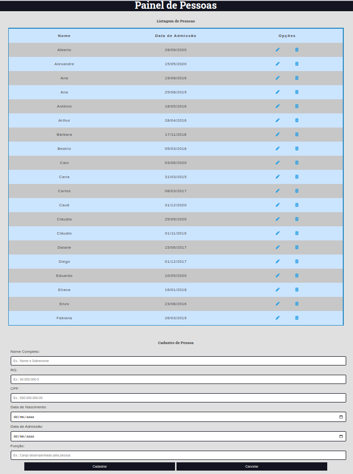

# Flask Crud Pessoas

Backend: Uma REST API para ações de CRUD.

Frontend: Página HTML que consome a API e sirve de interface para os comandos CRUD.





# Equipe:

* **Thiago Pires** - *Backend/Frontend Developer*;

## Requisitos:

* Python 3.8.10
* Javascript;
* Vue 2;
* Axios;

## Instalção:
1. Clone o projeto:
### Backend
2. Crie um ambiente virtual:
```
python3 -m venv venv
```
3. Acesse o ambiente virtual:
```
source venv/bin/activate
```
4. Instale os requisitos:
```
pip install -r requirements.txt
```
5. Adicione app.config['SQLALCHEMY_DATABASE_URI']
6. Execute o projeto:
```
python3 backend/app.py  
```
### Frontend
7. Abra o arquivo index.html:

## Endpoints:

Pessoas:

Post
```
http://127.0.0.1:5000/pessoas

{
    "nome": "Carla",
    "rg": "12.345.564-1",
    "cpf": "070.606.670-11",
    "data_nascimento": "2010-2-15",
    "data_admissao": "2022-4-28",
    "funcao": "estagiário"
}
```

Get
```
http://127.0.0.1:5000/pessoas (todas pessoas)
http://127.0.0.1:5000/pessoas/1 (pessoa por id)
```
put

```
http://127.0.0.1:5000/pessoas/1

{
    "nome": "Carla Almeida",
    "rg": "12.345.564-1",
    "cpf": "070.606.670-11",
    "data_nascimento": "2010-2-15",
    "data_admissao": "2022-4-28",
    "funcao": "Atendente"
}
```

Delete
```
http://127.0.0.1:5000/pessoas/1
```

## Ferramentas:

* [Visual Studio Code](https://code.visualstudio.com/)
* [Google Chrome](https://www.google.pt/intl/pt-PT/chrome/?brand=CHBD&gclid=Cj0KCQjwn_LrBRD4ARIsAFEQFKt3kLTIsdU6a-sk3FKsxrhplkKaYNHo6Pt3aRbaEAJ3TK4fZslZmtUaAvHVEALw_wcB&gclsrc=aw)
* [Postman](https://www.postman.com/)
